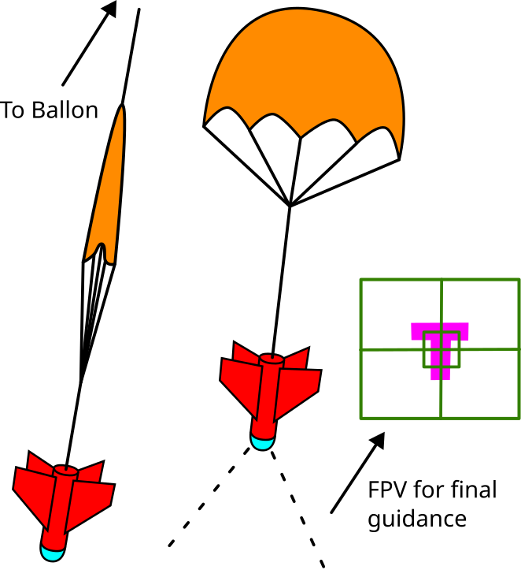

# Project Skyfall

## Goals:
- Safely guide a payload to a pre-designated location on the ground.
- Use GPS for rough guidance, and a FPV camera for final guidance.
## Design:
> CAD sketch is here: https://cad.onshape.com/documents/9a16aefde3d481029942141d/w/924ca9cb43d0417fb42f3d56/e/2a70d232c3196c04c939c1ef?renderMode=0&uiState=67f0615d9877b93a1bfcb1d7
- "Dropsonde with fins"
- Parachute always deployed above the body, and use to tether it to the ballon line.
## Challenges:
- We would need to make sure our project is at the end of the ballon line, to avoid tangles.
- Weight of a reasonably powerful FPV transmitter and battery could be high.
- We would need either 2 or 4 servos for the fins, and servos with sufficient torque are expensive, and potentially heavy.
- It would be another payload we have to track down and recover.
- We need a safe way to detach from the other payloads.
- Unusual shape, and it's not in a foam box, but I really think it can be made to work.
## Safety/legal:
- Being guided, skyfall would be the safest payload on the ballon.
- Parachute is always deployed, minimizing the risk of recovery failure.
- Payload is basically a glorified dropsonde, which the NWS launches without parachutes on a daily basis.
- Despite being guided, skyfall is primarily a drag device, and thus not subject to FAA UAS regulations.
## General components list:
- Battery
- FPV camera and transmitter
- GPS and guidance computer
- Radio for general communication (LoRa?)
- Parachute
- Way to seperate from the rest of the payloads.